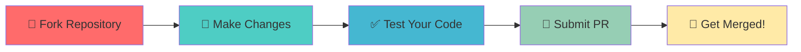

<div align="center">

<!-- Animated Typing SVG Header -->


<!-- Wave Animation -->


</div>

<div align="center">
  
<!-- Dynamic Badges -->
[](https://github.com/programmernexus)
[](https://www.programmernexus.com/)
[](https://www.youtube.com/@programmernexus)
[](https://t.me/programmernexus)

<!-- Stats Badges -->

[](https://github.com/programmernexus)

</div>

---

<div align="center">

## 💫 **Empowering the Next Generation of Developers**

### *Your journey from beginner to professional starts here*

</div>

<br>


### 🌟 **About ProgrammerNexus**

**ProgrammerNexus** is more than just a learning platform—it's a **vibrant community** dedicated to making programming accessible, engaging, and fun for everyone! 

Whether you're taking your first steps in coding or expanding your skillset into AI and app development, we provide the resources, mentorship, and community support you need to succeed.

#### ✨ **What Sets Us Apart**

🎯 **Mission-Driven** • Inspiring and educating the next generation of developers  
💡 **Beginner-Friendly** • Interactive lessons designed for learners at any level  
🤝 **Community-First** • A welcoming space to connect, collaborate, and grow  
🚀 **Real-World Focus** • Hands-on projects that build practical, job-ready skills  

<br clear="right"/>

---

## 🎓 **What We Offer**

<table>
<tr>
<td width="50%" valign="top">

### 📚 **Learning Resources**

- ✅ **Structured Courses** in HTML, CSS, JavaScript, Python & more
- ✅ **Interactive Coding Challenges** to practice your skills
- ✅ **Real-World Projects** that build your portfolio
- ✅ **AI & Machine Learning** tutorials for enthusiasts
- ✅ **Career Guidance** from portfolio building to job prep

</td>
<td width="50%" valign="top">

### 🌐 **Community Benefits**

- ✅ **Mentorship Programs** with industry professionals
- ✅ **Live Coding Sessions** and workshops
- ✅ **Peer Collaboration** on GitHub projects
- ✅ **Active Discussion Forums** on Telegram
- ✅ **Regular Updates** with latest tech trends

</td>
</tr>
</table>

---

## 🛠️ **Tech Stack & Focus Areas**

<div align="center">

### **Languages & Frameworks**


### **AI & Data Science**


### **Development Tools**


</div>

---

## 🚀 **Featured Projects**

<div align="center">

<table>
<tr>
<td width="50%">

### 🌐 WebDev Starter Kit
A comprehensive template for building modern, responsive websites with HTML, CSS, and JavaScript.

**Features:**
- 📱 Fully responsive design
- ⚡ Optimized performance
- 🎨 Modern UI components
- 📦 Ready-to-use templates

[](https://github.com/programmernexus)

</td>
<td width="50%">

### 🤖 AI Playground
Interactive Python projects to experiment with AI algorithms and machine learning concepts.

**Features:**
- 🧠 ML algorithm examples
- 📊 Data visualization tools
- 🎯 Beginner-friendly tutorials
- 💡 Real-world applications

[](https://github.com/programmernexus)

</td>
</tr>
<tr>
<td width="50%">

### 📱 App Builder
Step-by-step guidance for creating mobile applications from scratch.

**Features:**
- 📲 Cross-platform support
- 🎨 Beautiful UI templates
- 🔧 Complete documentation
- 🚀 Deployment guides

[](https://github.com/programmernexus)

</td>
<td width="50%">

### 🎓 Learning Hub
Curated collection of courses, tutorials, and resources for self-paced learning.

**Features:**
- 📚 Structured curriculum
- 🎥 Video tutorials
- 💻 Coding challenges
- 🏆 Certificates

[](https://github.com/programmernexus)

</td>
</tr>
</table>

</div>

---

## 🤝 **How to Contribute**

We ❤️ contributions from our community! Here's how you can get involved:

<div align="center">



</div>

### **Contribution Guidelines**

1. **🍴 Fork** one of our repositories
2. **🌿 Create** a new branch for your feature (`git checkout -b feature/AmazingFeature`)
3. **💻 Commit** your changes (`git commit -m 'Add some AmazingFeature'`)
4. **📤 Push** to the branch (`git push origin feature/AmazingFeature`)
5. **🎯 Open** a Pull Request

> 📖 Check out our detailed [Contributing Guidelines](CONTRIBUTING.md) for more information  
> 🐛 Found a bug? [Report it here](https://github.com/programmernexus/issues)  
> 💡 Have an idea? [Start a discussion](https://github.com/programmernexus/discussions)

---

## 🌐 **Connect With Us**

<div align="center">

### **Join Our Growing Community!**

<table>
<tr>
<td align="center" width="25%">
<a href="https://www.programmernexus.com/">

<br><b>Website</b>
<br>programmernexus.com
</a>
</td>
<td align="center" width="25%">
<a href="https://t.me/programmernexus">

<br><b>Telegram</b>
<br>@programmernexus
</a>
</td>
<td align="center" width="25%">
<a href="https://www.youtube.com/@programmernexus">

<br><b>YouTube</b>
<br>@programmernexus
</a>
</td>
<td align="center" width="25%">
<a href="https://facebook.com/programmernexus">

<br><b>Facebook</b>
<br>programmernexus
</a>
</td>
</tr>
<tr>
<td align="center" width="25%">
<a href="https://www.linkedin.com/company/programmernexus">

<br><b>LinkedIn</b>
<br>programmernexus
</a>
</td>
<td align="center" width="25%">
<a href="https://github.com/programmernexus">

<br><b>GitHub</b>
<br>@programmernexus
</a>
</td>
<td align="center" width="25%">
<a href="mailto:contact@programmernexus.com">

<br><b>Email</b>
<br>Get in Touch
</a>
</td>
<td align="center" width="25%">
<a href="https://github.com/programmernexus/discussions">

<br><b>Discussions</b>
<br>Ask Questions
</a>
</td>
</tr>
</table>

</div>

---

## 🎯 **Get Started Today**

<div align="center">

### **Ready to Begin Your Coding Journey?**

Follow these simple steps to get started:

</div>

```plaintext
┌─────────────────────────────────────────────────────────────────┐
│  Step 1: Visit our website → programmernexus.com                │
│  Step 2: Join our Telegram community → t.me/programmernexus     │
│  Step 3: Subscribe on YouTube → youtube.com/@programmernexus        │
│  Step 4: Explore our GitHub repos → github.com/programmernexus  │
│  Step 5: Start your first project! 🚀                           │
└─────────────────────────────────────────────────────────────────┘
```

---

## 🌍 **Our Vision**

<div align="center">

> ### *"Democratizing coding education and making technology accessible to all"*

We believe that **everyone deserves the opportunity** to learn programming and build a successful career in technology. Through our supportive community, practical resources, and expert mentorship, ProgrammerNexus is committed to helping you achieve your goals.

**🎓 Education** • **💼 Career Growth** • **🌟 Innovation** • **🤝 Community**

</div>

---

<div align="center">

## 💖 **Support Our Mission**

<br>

[](https://github.com/programmernexus)
[](https://twitter.com/intent/tweet?text=Check%20out%20ProgrammerNexus%20-%20Your%20ultimate%20hub%20for%20mastering%20programming!&url=https://github.com/programmernexus)
[](https://t.me/programmernexus)

<br>

### 📬 **Have Questions?**

Reach out on [Telegram](https://t.me/programmernexus) • Open an [Issue](https://github.com/programmernexus/issues) • Start a [Discussion](https://github.com/programmernexus/discussions)

<br>

### 🚀 **Ready to Code?**

**Let's build something amazing together!**

<br>

---

<br>

**Made with ❤️ by the ProgrammerNexus Team**

*Empowering developers worldwide since our inception* 

<br>

<!-- Wave Animation Footer -->


</div>
